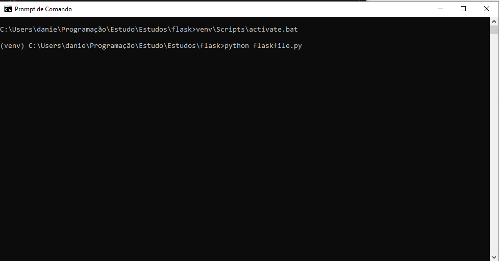

# Readme

This project is for the calculation of "Simples Nacional", tax regime for little companies in Brazil.

# Dependêncies

- Python 3
- Flask (Python module)

# Getting started

First clone the project, for the project works on your local machine it is necessary to install 1 module of Python.

With Python installed in your machine, install the module Virtualenv.

> pip install virtualenv

Using the terminal, go to the project paste and create the "venv", using the command:

> pip install virtualenv

And after the installation, activate the "venv" with the command:

> venv_name\Scripts\activate.bat

Now install the flask module in the "venv", using the command:

> pip install Flask

# How to use

With the project in your local machine, open the index.html file in the browser

Open the project paste in the terminal, and with the "venv" activate run the file "flaskfile.py", with the command:

> python flaskfile.py

The browser with the index.html is going to be the client-side and the python file "flaskfile.py" going to be the server-side the receives the http form and use the file "script.py" to make the calculation, that will return to the browser.

