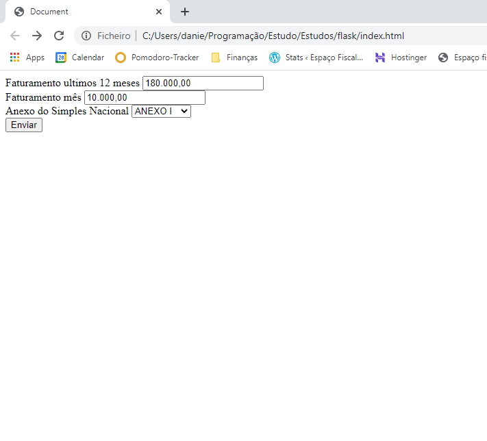

# Readme

This project is for calculation of "Simples Nacional", tax regime for little companys in the Brazil.

# Dependêncies

- Python 3
- Flask (Python module)

# Getting started

First clone the project, for the project works in your local machine it is necessary to install 1 module of the Python.

With the python instaled in you machine, instale the module Virtualenv.

pip install virtualenv

Using the terminal, go to the project paste and create the "venv", using the command:

pip install virtualenv

And after the instalation, activate the "venv" with the command:

venv_name\Scripts\activate.bat

Now install the flask module in the "venv", using the command:

pip install Flask

# How to use

With the project in your local machine, open the index.html file in the browser

